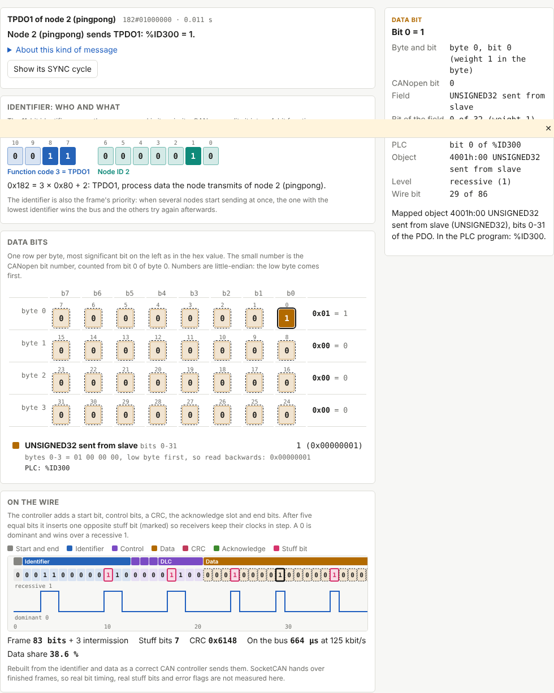
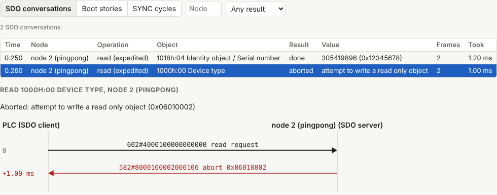
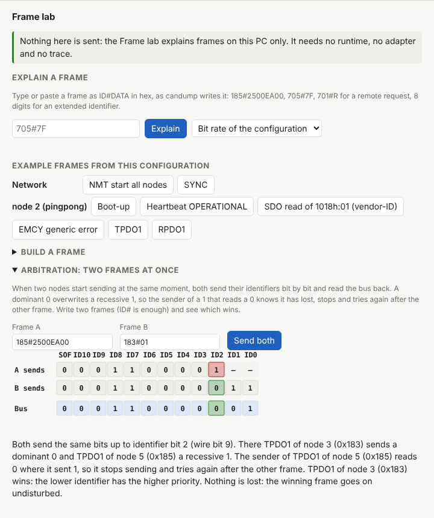

# Frame inspector: every bit of a CANopen frame, explained

The frame inspector takes one CAN frame and explains it layer by layer: what it says, who sent it and why (the identifier), what every data bit carries, and how the frame looks on the wire. It is for understanding how CANopen and CAN messaging work as much as for finding faults.

It is in three places:

- the configurator's **Trace** view: select a frame in a recorded or opened trace and the inspector opens under the list; the **Sequences** tab shows SDO conversations, boot stories and SYNC cycles made of many frames;
- the configurator's **Frame lab** view: type, paste or build frames without a runtime, a trace or an adapter, and see two frames compete for the bus;
- the command line: `openplc-canopen-diag explain`.

Nothing in the inspector or the Frame lab sends anything to the bus.



## The four layers

**What it says.** One sentence with the decoded meaning, using the node names, PDO mapping and PLC addresses of the configuration ("Node 5 (rtd) sends TPDO1: %IW100 = 37, %IW101 = 234."), plus a short text about the kind of message.

**Identifier.** The 11 identifier bits, split into the 4-bit function code (what kind of message) and the 7-bit node ID (which device), with the sum that builds it (`0x185 = 3 × 0x80 + 5`). A PDO or TIME identifier set in the configuration is shown as configured, without the split. The identifier is also the priority on the bus: the lowest one wins.

**Data bits.** One row per byte, the most significant bit on the left as in the hex value, each bit coloured by the field it belongs to and numbered with its CANopen bit number (bit 0 of byte 0 is bit 0). The field list below gives each field's value and how it is worked out, for example `bytes 0-1 = 25 00, low byte first, so read backwards: 0x0025`. CANopen numbers are little-endian. Every bit belongs to a field; unused bits say so.

**On the wire.** The frame rebuilt bit by bit as a CAN controller sends it: start of frame, identifier, control bits, data, CRC-15, acknowledge and end of frame, with the stuff bits marked and the bus level drawn (a 0 is dominant, a 1 recessive). The figures give the frame's length in bits, the stuff bits, the CRC, the time on the bus at the network's bit rate and the share of data bits.

Pointing at or tabbing to any bit or field shows its explanation in a box that stays in view, and lights the same bits in every layer: a data bit in the grid and on the wire, an identifier bit in the identifier and on the wire. Arrow keys move between bits; the wire strip is one tab stop that the left and right arrows walk through.

### What the wire layer is not

SocketCAN adapters hand over finished frames. The wire layer is rebuilt from the identifier and data: it is exactly what a correct controller sends, but real bit timing, real stuff bits, error flags and a faulty transceiver's waveform are not measured. An oscilloscope or a logic analyser shows those.

## Frames it knows

NMT commands, SYNC (with or without counter), TIME, EMCY (error code class, error register bits, manufacturer data), heartbeat and boot-up, node guarding, SDO (expedited, segmented and block transfers, every command specifier bit, abort codes), LSS, PDOs (EDS types, signed and float values, bit mappings, PLC addresses and, in a project, PLC variable names), SocketCAN error frames (error classes, controller and protocol details, error counters), remote requests and extended frames. An SDO segment explained from a trace is placed in its transfer: object, segment number, expected and received toggle bit and the bytes so far.

## Sequences



The Trace view's **Sequences** tab has three lists, filtered by node and result:

- **SDO conversations**: each transfer from its first request to its last answer or abort, with object, operation, expedited, segmented or block, value or abort text, frames and time taken. A conversation opens as a sequence diagram between the PLC and the node; every arrow opens its frame in the inspector.
- **Boot stories**: each boot of a node (boot-up message, or an NMT reset sent to it) up to its first PDO: the SDOs the master reads and writes, the NMT start, the first heartbeat in Operational and the first PDO, with their times. The master's writes are compared with the writes the configuration makes at boot, the same list as the network document's boot configuration, and missing, extra, different, refused and unanswered writes are marked.
- **SYNC cycles**: one SYNC period at a time as a timeline, with synchronous PDOs, other PDOs, SDO and other frames in lanes, each PDO's transmission type and, with a SYNC window set, whether each synchronous TPDO came inside it. Step through the cycles, jump to the slowest one or to the next cycle with late TPDOs.

From a frame in the list, the inspector offers its SDO conversation, SYNC cycle or boot story.

## Frame lab



The **Frame lab** view works with the configuration on the page, saved or not:

- **Explain a frame** typed or pasted in candump syntax: `185#2500EA00`, `705#7F`, `701#R` for a remote request, 8 identifier digits for an extended frame. The bit rate is the network's, or one picked from the list.
- **Example frames** made from the configuration: NMT start, SYNC, and per node its boot-up, heartbeat, an SDO read of 1018h:01, an EMCY and every PDO.
- **Build a frame**: an SDO read or write (expedited or segmented, with every answer), a PDO from values per signal (checked against each signal's range), an NMT command, a heartbeat or an EMCY.
- **Arbitration**: two frames sent at the same moment, bit by bit, with each sender's bit and the bus level, up to the bit where one sender sends a recessive 1, reads a dominant 0 and stops. With `185#…` and `183#…`, both are equal up to identifier bit 2, where node 3's frame wins.

## Command line

```sh
# A frame, explained with the project's names and mapping
openplc-canopen-diag explain 185#2500EA00 --config canopen/canopen.json

# Several frames, as JSON (the same model the configurator draws)
openplc-canopen-diag explain 705#7F 000#0105 --format json

# Frame 120 of a trace file, with the SDO frames before it as context
openplc-canopen-diag explain --trace boot.pcapng --index 120 --config canopen/canopen.json

# The wire layer at another bit rate
openplc-canopen-diag explain 080# --bitrate 1000000
```

The bit rate comes from `--bitrate`, else the config's network, else the trace file, else 500 kbit/s (and the output says it is assumed). Frames over 8 data bytes are refused: only classic CAN is supported. The text output draws the byte grid with a letter per field and the wire bits with stuff bits in brackets:

```
On the wire at 125 kbit/s
  79 bits + 3 intermission, 3 stuff bits, CRC 0x47DC, 632.0 us on the bus, 40 % data
  Start of frame:0 Identifier:00110000101 RTR:0 IDE:0 r0:0 DLC:0100
  Data:0010010100000[1]000111010100000[1]0000 CRC:100011111[0]011100 ...
```

## A short primer, by example

- `000#0105`: an NMT command, identifier 0 (the highest priority on the bus). Byte 0 is the command (01 = start), byte 1 the node (05; 00 would be all nodes).
- `705#00`: node 5's boot-up. Heartbeats use 700h + node ID; state 0 means it has just booted, 05 Operational, 7F Pre-operational.
- `080#`: SYNC. No data; its arrival is the message. Synchronous TPDOs answer right after it.
- `605#4018100100000000` and `585#4318100178563412`: an SDO read of 1018h:01 and its answer. The master asks on 600h + node, the node answers on 580h + node. Byte 0 is the command specifier (40 = read, 43 = answer with 4 data bytes), bytes 1-2 the index low byte first, byte 3 the subindex, bytes 4-7 the value, again low byte first: 0x12345678.
- `185#2500EA00`: node 5's TPDO1. A PDO has no header: what each bit means comes from the PDO mapping the master wrote at boot. Here bytes 0-1 are one 16-bit input (0x0025 = 37) and bytes 2-3 another (0x00EA = 234).
- `085#1023030000000000`: an EMCY of node 5: error code 0x2310 (its first digit, 2, is the current class), error register 0x03 (generic error and current).
