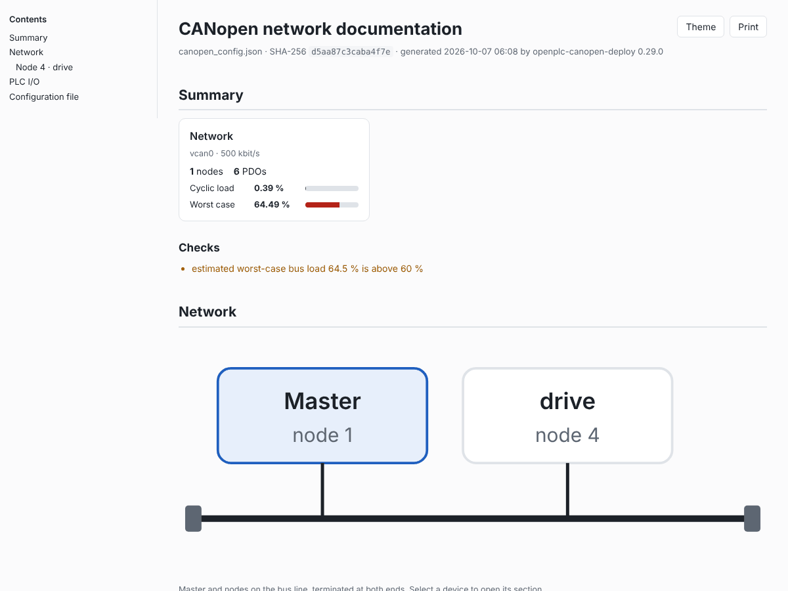
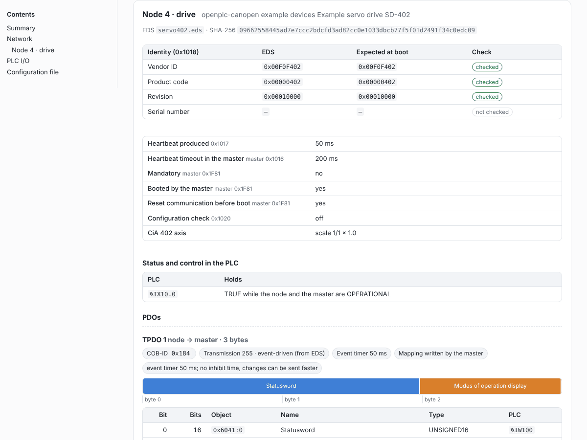

# Network documentation: one HTML file for people

The DCF and DBC exports are for other tools. The network documentation is for the people who commission, maintain or review a CANopen installation: one HTML file that shows the whole configured network, built from the config and the EDS files on the engineering PC, with no PLC, runtime or bus needed.

```sh
openplc-canopen-deploy --config canopen_config.json --export-html network.html
```

In the configurator, **Export documentation** in the header downloads the same document for the config as the page shows it, saved or not ([configurator.md](configurator.md#export-documentation)).



## What it holds

Every value comes from the code the deploy tool, the DCF export and the DBC export use, so the document shows what the plugin actually puts on the bus.

- **Summary:** the title, the config file name and its SHA-256, the tool version and date; per network the interface, bit rate, number of nodes and PDOs, and the estimated bus load; every warning the deploy checks and the export give.
- **Per network:**
  - a topology diagram of the master and the nodes on the bus line (each links to its section);
  - the master and bus settings: adapter, bit rate, master node ID, SYNC (timer, PLC cycle or off; window, counter), master heartbeat and heartbeat consumers, TIME, NMT start options, boot time, SDO timeout, error behaviour, EDS lint, and whether diagnostics are on (port and read-only or not; never the token);
  - the master's status addresses in the PLC (bus state, error counters, master state);
  - the **COB-ID map**: every frame on the bus sorted by COB-ID (NMT, SYNC, TIME, EMCY, each PDO, each node's SDO channels, heartbeats or node guarding, the master heartbeat or, with the heartbeat off, its boot-up message), with producer, consumers, data length, period or trigger, frame bits and load share; a COB-ID used twice is flagged;
  - the **bus load estimate** (below).
- **Per node:**
  - identity: vendor and product name from the EDS, vendor ID, product code and revision from the EDS next to what the master expects at boot and whether each is checked, the EDS file name and its SHA-256;
  - settings: heartbeat or node guarding, mandatory, boot, communication reset, TIME, error behaviour, restore, configuration check, store, LSS, program download, CiA 402 axis;
  - status and control addresses in the PLC and what each holds;
  - each **PDO**: COB-ID, transmission type (marked when it comes from the EDS), inhibit time, event timer or deadline, SYNC start, whether the master writes the mapping or the device's mapping is kept, a byte layout bar and a table of bit offset, length, object, name, type, PLC address and PLC variable;
  - the **boot configuration**: every SDO write the master makes at boot, in order, with object, name, value, its meaning for CiA 301 objects (COB-IDs, transmission types, mapping entries, heartbeat, ...), access, EDS default and where it comes from (PDO configuration, node settings, startup SDO, configuration check); the same writes the DCF export puts into `ParameterValue`;
  - SDO variables with their settings;
  - an object dictionary extract: the objects the configuration writes or maps (or every object with `--doc-od all`), with type, access, limits, EDS default and configured value.
- **Slave networks:** where OpenPLC is a device of another master's network ([slave.md](slave.md)), the network section shows the upper master and OpenPLC, the slave settings, the device as its EDS defines it (identity, PDOs, object dictionary extract), every bound object with its direction, PLC address and the PDO bits that carry it, the own status addresses, and the frames it sends and receives. The bus load counts only what the device times itself: its heartbeat, and event-driven TPDOs at most once per PLC scan when the PLC cycle is known; the upper master's frames are not in the configuration.
- **Gateway:** with a [gateway](gateway.md), a section with its settings and every route between the upper network and the field nodes, linked to the field node.
- **PLC I/O cross-reference:** every PLC address the configuration uses, sorted by address, with network, node, what it is and the config field.
- **Appendix:** the config file itself (with the diagnostics token hash removed).

In an editor project (`--config <project>/canopen/canopen.json`, or the configurator in project mode), PLC addresses show the names of the located variables declared at them.



## Bus load estimate

Each frame counts 47 + 8 × DLC bits (11-bit identifier, interframe space) plus its worst-case stuff bits, ⌊(34 + 8 × DLC − 1) / 4⌋, times its rate, divided by the bit rate. The document gives two totals per network:

- **Cyclic:** SYNC, synchronous PDOs (SYNC period × transmission type), node heartbeats or node guarding (request and answer every guard time), the master heartbeat and TIME.
- **Worst case:** the cyclic load plus each event-driven PDO at its fastest. A TPDO counts at its inhibit time, else at its event timer (a device may send faster on change without an inhibit time; the document says so), and one with neither is listed as unbounded with a warning. An RPDO the master sends on change counts at the SYNC rate, or every millisecond without SYNC (the master's output check). Acyclic synchronous PDOs (type 0) count at the SYNC rate.

NMT, EMCY, SDO and LSS frames are not counted: they come at start-up, on error or on demand. A worst case above 60 % gives a warning. With SYNC from the PLC cycle, the SYNC period is the PLC task interval: the editor project's task interval is used when the config is in a project, `--doc-cycle-ms` gives it otherwise; without it SYNC and synchronous PDOs are left out of the totals with a note.

It is an estimate from the configuration, not a measurement. The configurator's **Trace** view measures the real bus ([trace.md](trace.md)).

## Options

| Option | Meaning |
|---|---|
| `--export-html FILE` | Write the document to FILE (through a temporary file and a rename). |
| `--network NAME` | Only this network of a config with several. |
| `--doc-title TEXT` | The document's title (default "CANopen network documentation"). |
| `--doc-od used\|all` | The object dictionary extract per node: the objects the configuration writes or maps (default), or every object of the EDS. |
| `--doc-embed-eds` | Embed each node's EDS file, so it can be saved from the document. Off by default: EDS files can be large and vendor files may carry licence terms. The SHA-256 of each file is always there. |
| `--doc-cycle-ms MS` | The PLC task interval, for the bus load of a network whose SYNC follows the PLC cycle. |

The tool runs the deploy checks first and writes nothing if they fail. Nothing is built or uploaded; `--runtime`, `--output` and `--check-only` are refused with it, and the `--doc-*` options without `--export-html`.

## Reading, printing, archiving

- The file is self-contained: styles, script and diagrams are inline, nothing is loaded from the network, and every table is in the HTML, so it also reads with scripts off. Mail it, attach it to a commissioning record, or keep it next to the project.
- Tables sort by any column (click the header); the COB-ID map, the PLC I/O list and the object dictionary extracts have a filter box. Sections have stable links such as `network.html#node-drives-4` (`#node-4` with one unnamed network) and `#pdo-drives-4-tpdo1`.
- **Theme** switches between light and dark; by default the page follows the system.
- **Print** (or the browser's print, "Save as PDF") gives a paginated document: no navigation, the object dictionary and config sections expanded, each network and node on a new page, table headers repeated.
- The data behind the page is in the file as JSON (`<script type="application/json" id="canopen-doc">`, `doc_schema_version` 1), for scripts that want networks, nodes, frames, PDOs, boot writes and I/O without parsing HTML.
- Two exports of an unchanged config and EDS files differ only in the generation date, so they compare cleanly.
- The document never holds the diagnostics token or its hash, or paths of the PC that exported it: files show as the config names them (an absolute path only by its file name).
