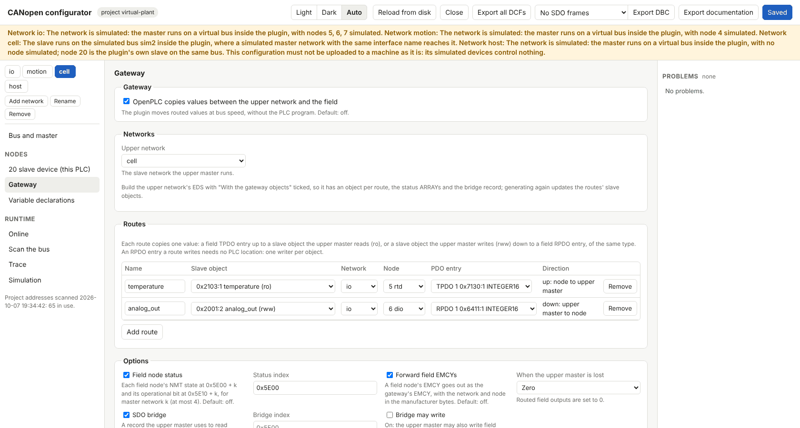
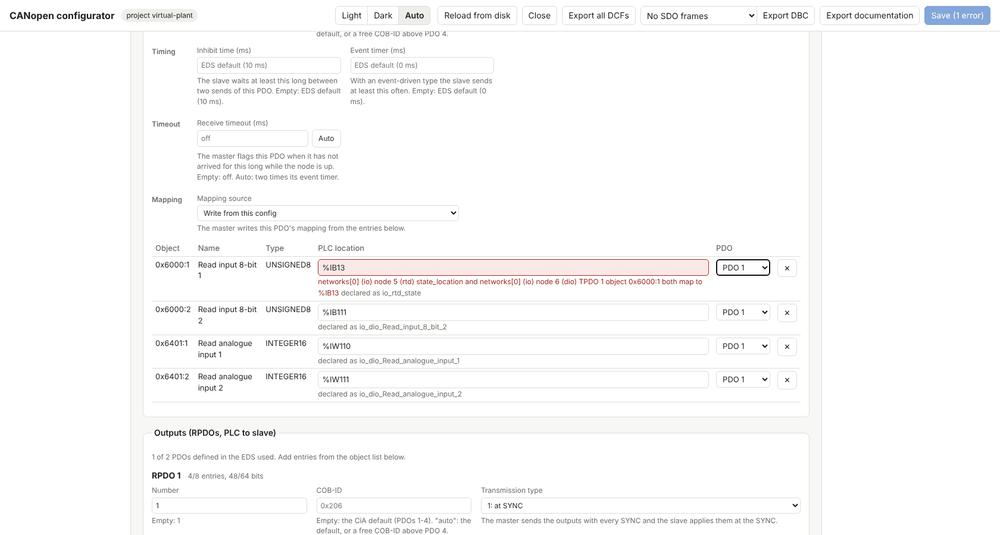

# Tour: every feature on a PC, without hardware

This tour takes you through [`examples/virtual-plant`](../examples/virtual-plant/README.md), one editor project with four simulated CANopen networks, on Windows, macOS or Linux. You need a container engine, the PC tools and OpenPLC Editor 4.3.2; no Raspberry Pi, no CAN adapter, no devices. Each chapter says what to do, what you see, and where the feature is described in full.

The plant: an I/O network `io` with a temperature module (node 5, RTD-8), a digital and analogue I/O module (node 6, DIO-16) and a second DIO-16 that gets its node ID over LSS (node 7); a drive network `motion` with a servo drive (node 4) in cyclic synchronous position mode; and the PLC as a gateway (slave node 20 on network `cell`) to a machine controller, which network `host` plays on the same simulated bus. All devices are made up. The [example's README](../examples/virtual-plant/README.md) lists every network, file and part of the program.

Times and cycle figures in a container say nothing about a real target.

## 1. Install

1. A container engine: on Windows, Ubuntu in WSL2 with Docker Engine or Podman; on macOS, Colima; on Linux, Docker Engine or Podman ([local-runtime.md](local-runtime.md#container-engine-once-per-pc)).
2. The PC tools with uv ([install-pc.md](install-pc.md)), then check: `openplc-canopen-deploy --version`.
3. The editor library with the SDO and cyclic drive blocks the program uses ([plc-sdo.md](plc-sdo.md)); start the editor once first, then:

   ```sh
   openplc-canopen-deploy library --install
   ```

4. The local simulator runtime:

   ```sh
   openplc-canopen-sim-runtime start
   ```

   It prints the address `localhost:8443`, the user and the password for the editor.
5. The example: download the repository (**Code → Download ZIP** on GitHub, or `git clone`) and copy `examples/virtual-plant` to where you keep editor projects.

The diagnostics token of the example is `virtual-plant-demo`. Set it for the command line in this terminal:

```sh
export OPENPLC_CANOPEN_TOKEN=virtual-plant-demo        # PowerShell: $env:OPENPLC_CANOPEN_TOKEN = "virtual-plant-demo"
```

## 2. The configurator and its checks

```sh
openplc-canopen-config path/to/virtual-plant
```

The page opens on the project with one tab per network: `io`, `motion`, `cell`, `host` ([configurator.md](configurator.md#several-networks)). Look around:

- `io` → node `dio`: the PDOs it maps from the config, the startup SDO 0x2000, the SDO variables `operating_hours` and `filter_time`, and under **Advanced settings** the configuration check, store sub-index 1, the NMT command byte and the TIME COB-ID with the consumer bit. Node `new_io` has a serial number and **Assign node ID by serial number**. Node `rtd` is mandatory and its TPDO 1 has a receive timeout of 200 ms with a status bit.
- `motion` → node `drive`: **CiA 402 axis** with cyclic synchronous modes; the master's SYNC follows the PLC cycle.
- `cell`: the slave network with the objects the program reads and writes; **Gateway** with its two routes, the field status, EMCY forwarding, the SDO bridge and **On upper loss: zero** ([gateway.md](gateway.md)).
- `host`: node 20 is the cell itself, not simulated: the plugin's own slave answers.



**A deliberate mistake:** on `io` → `dio`, change the PLC address of TPDO 1's first entry from `%IB110` to `%IB13`. **Problems** at once reports that `%IB13` is already node `rtd`'s state byte, the field turns red and **Save** is disabled. Change it back ([configurator.md](configurator.md#checks-and-saving)). The deploy tool runs the same checks ([deploy.md](deploy.md)).



## 3. Exports

From the configurator's header, or from a terminal in the project folder:

```sh
openplc-canopen-deploy --export-html plant.html --config canopen/canopen.json      # network documentation
openplc-canopen-deploy --export-dcf dcf --config canopen/canopen.json              # a DCF per node, a folder per network
openplc-canopen-deploy --export-dbc io.dbc --network io --config canopen/canopen.json
openplc-canopen-deploy slave-eds canopen/cell_eds.json -o cell.eds --gateway canopen/canopen.json
```

`plant.html` is one offline document: the topology, COB-ID map and bus load of each network, every node's PDO layouts and boot SDO writes, and the PLC I/O cross-reference with the program's variable names ([network-docs.md](network-docs.md)). The DCF files are what a master configures on each node ([deploy.md](deploy.md#export-the-nodes-as-dcf-files)); the DBC file opens in SavvyCAN or Wireshark ([deploy.md](deploy.md#export-the-network-as-a-dbc-file)). `slave-eds` writes the EDS the machine controller's tool would import for node 20, with a slave object per route and the gateway's status and SDO bridge objects ([slave.md](slave.md), [gateway.md](gateway.md)); it is the same as the project's `canopen/cell.eds`.

## 4. Upload and the debugger

In the editor: open the project folder, set the device to OpenPLC Runtime v4 at `localhost:8443` with the printed user and password, and **Build and Upload** ([local-runtime.md](local-runtime.md#use-it)). The `canopen/` folder travels with the upload.

`openplc-canopen-sim-runtime logs` shows the start: each network's simulated bus, `node 7 (new_io): LSS assigned node ID 7 (previous: none)`, then every node OPERATIONAL, `host: node 20 (cell) is operational` and `cell: gateway: the upper master started this node; routes run`.

Start the debugger on `main`. You see:

- `io_rtd_AI0_Input_PV` moving between 200 and 260 (20.0-26.0 °C, a 30 s sine) and `temp_c`; `alarm` comes on above 25.0 °C;
- `pattern` walking along output byte 2 and `loop_ok` TRUE;
- `host_cell_temperature`, the RTD value as the host receives it through the gateway, and `io_dio_Read_analogue_input_1`, the same value after the host sent it back down to the DIO-16;
- `motion_drive_Position_actual_value` going between 0 and 1000, and `moves` counting;
- `rtd_product`, `drive_modes`, read by the SDO function blocks; `io_dio_operating_hours`, read by an SDO variable every second.

The deploy tool does the same upload from a command line: `openplc-canopen-deploy --runtime local --config canopen/canopen.json --project .` after **Build only** in the editor ([deploy.md](deploy.md)).

## 5. Online diagnostics

In the configurator, **Online access** → **Local simulator runtime**, token `virtual-plant-demo`, then **Online** ([configurator.md](configurator.md#online-view)). Pick each network:

- `io`: master and bus state, nodes 5, 6, 7 OPERATIONAL, the TPDO 1 timeout line of node 5, the SDO variables of node 6, every 60 s an EMCY 0x5000 from node 5 (the simulation's wire-break timeline) in its **Emergency history**.
- `cell`: the plugin's own device, node 20: its state, SYNC count, PDOs with the gateway routes, and the gateway row: 2 routes, upper master present.
- On node 6, **NMT** → **Reset node**: the node boots again, and because its configuration stamp (0x1020) still matches, the master starts it without downloading the configuration again ([config.md](config.md#configuration-check)).

From a terminal:

```sh
openplc-canopen-diag --runtime local status
openplc-canopen-diag --runtime local sdo-read 6 0x1018 2 --network io
openplc-canopen-diag --runtime local emcy 5 --network io
```

[diagnostics.md](diagnostics.md) lists every command.

## 6. Device parameters

`io` → node 6 → **Object dictionary**: **Read all**, then the **Changed from default** filter shows what the config wrote (the PDO mapping, 0x2000, 0x1012). On node 5, edit 0x6110 sub 3 (channel 2's filter) to 30 and pick **Keep in configuration**: it becomes a startup SDO in the page, to save and upload. **Parameters** → **Back up** downloads a DCF of the node; **Compare** it against the configuration; **Store on device…** writes "save" to 0x1010, and the simulated device keeps the values over a power cycle ([configurator.md](configurator.md#online-view)).

`openplc-canopen-diag --runtime local backup 6 --network io -o dio.dcf` does the backup from a terminal.

## 7. Simulation and faults

**Simulation** in the configurator, network `io` ([configurator.md](configurator.md#simulation-view), [simulator.md](simulator.md)):

- node 5: the value sources of the four channels (sine, random walk, ramp, a formula on channel 0); **Override** channel 0 with 300: `alarm` comes on, DIO-16 output 0.0 follows, and on `host` the cell's `host_cell_alarm` with EMCY 0x4210;
- node 6: **Heartbeat stop**. Node 6's status bit goes FALSE, the program's `fault` switches `new_io` output 0.0 on, and the gateway status on `cell` shows node 6 missing, so the host's output 0.1 comes on too. **Clear all** and the master boots node 6 again;
- node 5: **TPDO stop** 1: after 200 ms `io_rtd_tpdo1_timeout` is TRUE while node 5 stays OPERATIONAL;
- the simulation file editor shows the `io` section; switch the network picker to `motion` for the drive model's section. Both are in the one `canopen/simulation.json` (version 2, a section per network).

The same from a terminal: `openplc-canopen-diag --runtime local sim fault 6 heartbeat-stop --network io`, `sim clear 6 all --network io`.

## 8. LSS

`new_io` (node 7) got its node ID at start from the master, by its serial number 7007 ([config.md](config.md#lss)). A second module, `spare_io` (serial 7099), is on the bus without a node ID and is not in the config: **Online** → `io` → **Unconfigured devices (LSS)** → **Find a device without node ID** finds it; **Set node ID…** gives it, say, 8, and the page offers to add it as a node. **Scan the bus** then lists node 8 as not configured ([configurator.md](configurator.md#scan-the-bus)).

```sh
openplc-canopen-diag --runtime local lss-find --network io
```

## 9. The drive

Network `motion`: the program powers the axis, homes it and moves it between 0 and 1000 with `CO402_CyclicMoveAbsolute`, a new position every PLC cycle on the SYNC the cycle sends ([cia402.md](cia402.md#cyclic-synchronous-modes)). In **Online** → `motion` → node 4, watch 0x6041 (statusword, **Bits** names each bit), 0x6061 (mode 8, CSP) and 0x6064. In **Simulation** on `motion`, **Drive inputs…** → **blocked**: the axis cannot move, the drive reports a following error, and the program resets it in step 90 and starts again once you clear the input. The host stops the line when it is lost (next chapter), and the drive then stays put after its current move.

## 10. Slave and gateway

The cell (node 20) is the PLC as a slave: the host writes `line_run` and `temp_limit`, the program writes `alarm`, `axis_position` and `cycle_count` ([slave.md](slave.md)). The gateway copies RTD channel 0 up and the host's `analog_out` down to DIO-16 analogue output 1 in the plugin, without the program ([gateway.md](gateway.md)).

- **Online** → `host` → node 20 → **Object dictionary**: 0x5E00 sub 5, 6, 7 are the NMT states of the field nodes on `io`, 0x5E10 sub 1 their operational bits; 0x5E01/0x5E11 those of `motion`.
- The SDO bridge: write the network (0), node (5), index 0x1018, sub-index 2, then command 1 to 0x5F00 from node 20's SDO panel on `host`, and read the product code of node 5 back in sub-index 5 ([gateway.md](gateway.md#sdo-bridge)).
- Upper master lost: **Online** → `host` → node 20 → **NMT** → **Stop**. The cell leaves OPERATIONAL, `cell_line_run` drops (inputs on loss: zero), the drive stops after its move, and the gateway sets DIO-16 analogue output 1 to 0. **Start** brings it back.

## 11. Trace with a trigger

**Trace**, network `io` ([trace.md](trace.md)): **Start**, and the frames scroll decoded with the config's names; **Identifiers** shows each COB-ID's cycle time (SYNC every 20 ms, TIME every second). **Graph**: add node 5's channel 0 and node 6's analogue input 1 in one lane and see the second follow the first through the gateway and the host. **Trigger**: EMCY from node 5, single mode, 2 s before and after; the wire-break timeline fires it within a minute, and the hit is listed and marked in the graph. **Export** the window as pcapng for Wireshark, or candump or CSV.

## 12. Frame inspector

Select any frame of the trace: the inspector below the list explains it layer by layer, from the decoded meaning down to every bit on the wire. The **Sequences** tab shows node 6's boot as a story after the NMT reset of chapter 5, and the SDO conversations of the SDO variables ([frame-inspector.md](frame-inspector.md)). **Frame lab** builds frames by hand without a bus.

## 13. Sending raw frames

**Trace** → **Send** (needs **Allow changes**, which the example has): send `0x000` with data `81 06` (NMT reset node 6). The runtime asks for force, because 0x000 is an identifier the network uses; confirm, and node 6 boots again in the trace. A cyclic frame on a free identifier, say `0x6FF` every 100 ms, shows as Tx in the trace until you stop it ([diagnostics.md](diagnostics.md#sending-frames-by-hand)).

## 14. Scenario tests

`canopen/simulation.json` has four scenarios marked as tests: `alarm`, `gateway-route` and `dio-lost` on `io`, `drive-moves` on `motion`. They change the simulated devices and check the program's reaction on the bus:

```sh
openplc-canopen-diag --runtime local sim test --network io --scenario alarm --scenario gateway-route --scenario dio-lost --junit io.xml
openplc-canopen-diag --runtime local sim test --network motion --scenario drive-moves
```

Each prints PASS or FAIL with the step and value that failed, and `--junit` writes a report for a CI system ([diagnostics.md](diagnostics.md#simulated-devices-sim)). Change the alarm limit in the program to 30.0 °C, upload, and `alarm` fails. CI runs the same tests on every change to the plugin or the example ([`test/virtual-example/run.sh`](../test/virtual-example/run.sh)).

When you are done: `openplc-canopen-sim-runtime stop`, or `remove --data` to delete it.

## What needs hardware

Some features cannot be shown on a simulated bus:

- **Bit rate detection** listens to real traffic at each rate; a simulated bus has no bit rate ([diagnostics.md](diagnostics.md#finding-the-bit-rate)).
- **slcan adapters** (CANable and similar) and unplugging one while the bus runs need the adapter ([config.md](config.md)).
- **Bus error states** (error passive, bus-off and recovery) need a real controller and a fault on the wire.
- **Commissioning straight from the PC** through a USB adapter, with no runtime, needs the adapter and a device ([pc-adapter.md](pc-adapter.md)).
- **Program download** to a device (0x1F51, `software_file`) is not simulated.
- **Real-time timing**: SYNC jitter, PDO latency and the drive's cycle in a container say nothing about a real target.
- **The install on a runtime host** (`install-stock.sh` on a Raspberry Pi or another Linux device) and its CAN interface ([install-stock.md](install-stock.md)).
